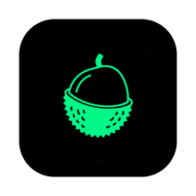
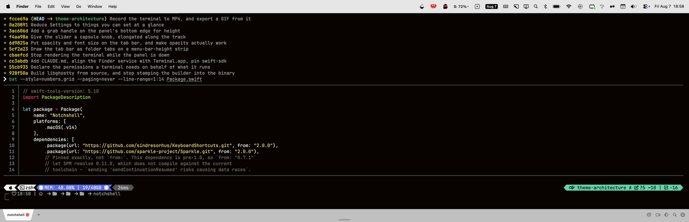
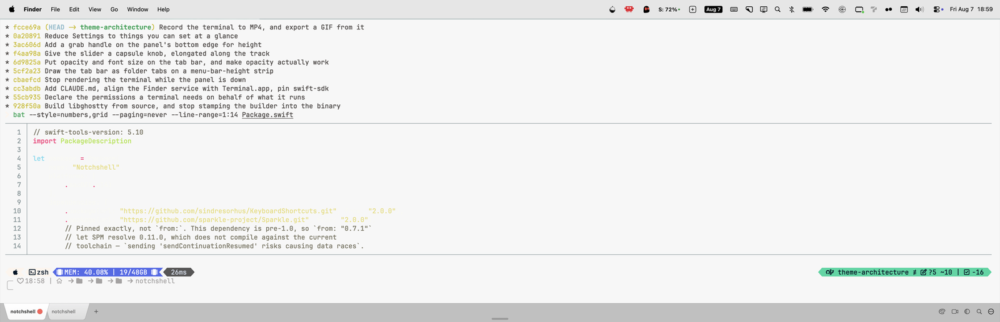
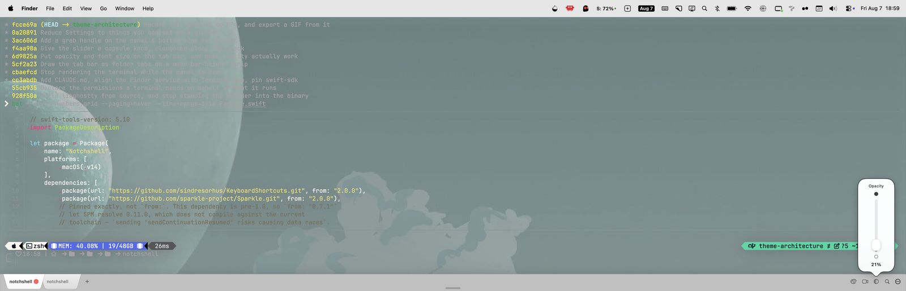
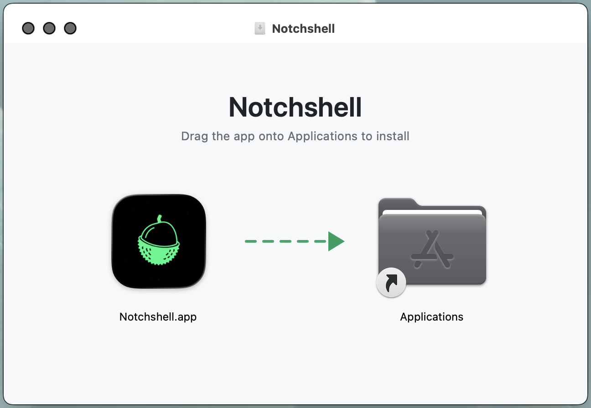

<div align="center">



<h1>Notchshell</h1>

<b>One hotkey. The terminal is already open.</b>

A terminal, not a cockpit — it just happens to know which agent is waiting for you.

<p>


</p>


<h3><a href="https://github.com/hakanuzum/notchshell/releases/latest">Download</a> · <a href="docs/media/tour.mp4">Watch the tour</a></h3>

<sub>Press <kbd>⌥</kbd> <kbd>Space</kbd> anywhere and it slides down over whatever you were doing. Press it again and it is gone.</sub>

</div>

---

<table width="100%">
<tbody>
<tr valign="top">
<td width="50%">

### It knows which agent is waiting

Run `claude`, `codex`, `gemini` or a dozen others and the tab wears that tool's
mark. When one finishes — or stops to ask you something — while the panel is
down, it says so: a notification you can click to land in the right tab, and a
dot that stays until you look.

Come back to a folder you have worked in before and the mark is still there,
faded. One click picks the conversation back up.

</td>
<td width="50%">

### Everything it does, one keystroke away

<kbd>⌘</kbd> <kbd>P</kbd> opens a search box over the terminal: every command,
every one of the 602 themes, by name.

No dashboards, no side panels, no second app to learn. The terminal keeps the
screen; the rest gets out of the way.

</td>
</tr>
</tbody>
</table>

---

<table width="100%">
<tbody>
<tr valign="top">
<td width="50%">

<h3>Tabs and split panes</h3>
<p><kbd>⌘</kbd> <kbd>D</kbd> splits right, <kbd>⌘</kbd> <kbd>⇧</kbd> <kbd>D</kbd> splits down, and every pane is a real shell. <kbd>⌘</kbd> <kbd>⇧</kbd> <kbd>↩</kbd> blows one pane up to fill the tab and back again.</p>
<p>Quit with three tabs and a split, and that is what comes back — the shape, the proportions, and each pane in its own folder.</p>
</td>
<td width="50%">

<h3>602 themes, applied live</h3>
<p>The whole <a href="https://github.com/mbadolato/iTerm2-Color-Schemes">iTerm2-Color-Schemes</a> catalog ships with the app, so it works on a clean machine with nothing else installed.</p>
<p>Pick one and the running panes repaint — no restart, no reload.</p>
</td>
</tr>
<tr valign="top">
<td width="50%">

<h3>Opacity, font size and height</h3>
<p>The three things people actually reach for are one click away on the tab bar, not buried in Settings. Drag the handle on the bottom edge to resize the panel.</p>
</td>
<td width="50%">
<h3>Record what you did</h3>
<p>The camera button records the active tab to MP4 in <code>~/Movies/Notchshell</code>, and can export a GIF from it afterwards.</p>
<p>Only the terminal is in frame — not the chrome, not the tab bar, not what is behind the panel.</p>
<h3>Open it where you already are</h3>
<p><code>notchshell .</code> drops a tab in this folder, the way <code>code .</code> or <code>zed .</code> works.</p>
</td>
</tr>
</tbody>
</table>

---

## Install

<table width="100%">
<tbody>
<tr valign="top">
<td width="52%">

</td>
<td width="48%">
<p>Download the latest <code>.dmg</code> from <a href="https://github.com/hakanuzum/notchshell/releases/latest"><b>Releases</b></a>, open it, and drag the app onto Applications.</p>
<p>The build is signed ad-hoc rather than notarized, so Gatekeeper stops the first launch. Right-click the app in <code>/Applications</code> and choose <b>Open</b> once; after that it opens normally.</p>
<p>Notchshell lives in the menu bar and has no Dock icon.</p>
</td>
</tr>
</tbody>
</table>

## Reach it from anywhere

Open Help (<kbd>⌘</kbd> <kbd>/</kbd>) once and press **Install Command Line Tool** — it
links `notchshell` into `~/.local/bin`. Then, from any shell:

```bash
notchshell .            # a tab in this folder, like code . or zed .
notchshell ~/src/app    # or any other
notchshell              # just drop the terminal
```

macOS has no "default terminal" setting, so Notchshell answers the other routes too:
Finder's *Services → New Notchshell Tab Here*, `open -a Notchshell <path>`, and the
`notchshell://` URL scheme. In VS Code, point `"terminal.external.osxExec"` at
`Notchshell.app` and *Open in External Terminal* lands here. Help (<kbd>⌘</kbd> <kbd>/</kbd>)
lists them all.

## Shortcuts

<table width="100%">
<tbody>
<tr><td width="26%">Toggle terminal</td><td width="24%"><kbd>⌥</kbd> <kbd>Space</kbd></td><td width="26%">Split right · down</td><td width="24%"><kbd>⌘</kbd> <kbd>D</kbd> · <kbd>⌘</kbd> <kbd>⇧</kbd> <kbd>D</kbd></td></tr>
<tr><td>Pin / unpin</td><td><kbd>⌘</kbd> <kbd>⇧</kbd> <kbd>P</kbd></td><td>Next / previous pane</td><td><kbd>⌘</kbd> <kbd>]</kbd> · <kbd>⌘</kbd> <kbd>[</kbd></td></tr>
<tr><td>New tab · close</td><td><kbd>⌘</kbd> <kbd>T</kbd> · <kbd>⌘</kbd> <kbd>W</kbd></td><td>Zoom pane</td><td><kbd>⌘</kbd> <kbd>⇧</kbd> <kbd>↩</kbd></td></tr>
<tr><td>Reopen closed tab</td><td><kbd>⌘</kbd> <kbd>⇧</kbd> <kbd>T</kbd></td><td>Copy · paste</td><td><kbd>⌘</kbd> <kbd>C</kbd> · <kbd>⌘</kbd> <kbd>V</kbd></td></tr>
<tr><td>Next / previous tab</td><td><kbd>⌘</kbd> <kbd>⇧</kbd> <kbd>]</kbd> · <kbd>⌘</kbd> <kbd>⇧</kbd> <kbd>[</kbd></td><td>Clear screen · find</td><td><kbd>⌘</kbd> <kbd>K</kbd> · <kbd>⌘</kbd> <kbd>F</kbd></td></tr>
<tr><td>Go to tab 1–9</td><td><kbd>⌘</kbd> <kbd>1</kbd> – <kbd>⌘</kbd> <kbd>9</kbd></td><td>Command palette</td><td><kbd>⌘</kbd> <kbd>P</kbd></td></tr>
<tr><td>Rename tab</td><td>double-click</td><td>Settings · Help</td><td><kbd>⌘</kbd> <kbd>,</kbd> · <kbd>⌘</kbd> <kbd>/</kbd></td></tr>
</tbody>
</table>

Unpinned, the panel hides when it loses focus — pin it to keep it down. Every shortcut
above except <kbd>⌘</kbd> <kbd>1</kbd>–<kbd>⌘</kbd> <kbd>9</kbd>, <kbd>⌃</kbd> <kbd>⇥</kbd>
and <kbd>⌘</kbd> <kbd>/</kbd> can be changed in Settings.

---

<details>
<summary><b>Under the hood</b></summary>

<br>

Swift and AppKit — no Electron, no web view. The terminal itself is
[Ghostty](https://ghostty.org), GPU-rendered on Metal, with true colour and ligatures.

**Your config stays yours.** Notchshell reads `~/.config/ghostty/config` and **never
writes to it**. Anything you change in the app lands in
`~/.config/notchshell/overrides.conf`, which your config is included into. It does not
write your shell configuration either.

**Automation**, all off or ask-first by default, and nothing phones home:

```bash
# Unix socket — JSON in, JSON out. See API.md for every action.
echo '{"action":"state"}' | nc -U /tmp/notchshell.sock

# MCP — an HTTP server exposing 18 tools, so an agent can drive the terminal
claude mcp add --transport http notchshell http://localhost:19876/mcp
```

**Build from source.** Needs macOS 14+, a full Xcode install (not just Command Line
Tools) and **Zig 0.15.2 exactly** — libghostty is version-gated and 0.16 fails
immediately.

```bash
git clone --recursive https://github.com/hakanuzum/notchshell.git
cd notchshell && brew install zig@0.15
./scripts/build-ghostty.sh     # libghostty from vendor/ghostty (slow, once)
./scripts/build-install.sh     # build, sign, install to /Applications
./scripts/run-tests.sh         # every suite
```

</details>

## License and credits

© 2026 Hakan Uzum. The source is public to read and the app is free for personal,
non-commercial use — but **commercial use and redistribution are not permitted**. See
[LICENSE](LICENSE) for the exact terms.

Notchshell began as a fork of [macuake](https://github.com/menemy/macuake) by menemy
(MIT), and owes it the shape of the thing. It stands on
[Ghostty](https://ghostty.org) (MIT) for the terminal,
[iTerm2-Color-Schemes](https://github.com/mbadolato/iTerm2-Color-Schemes) (MIT) for the
themes, and [Sparkle](https://sparkle-project.org) for updates. Their notices are
reproduced in [LICENSE](LICENSE).
